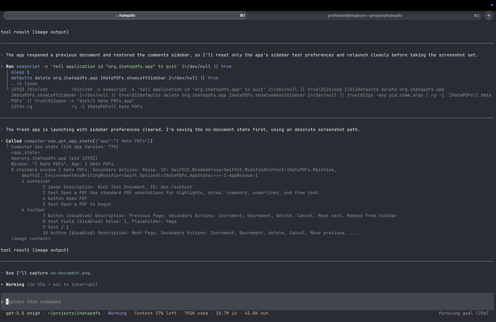
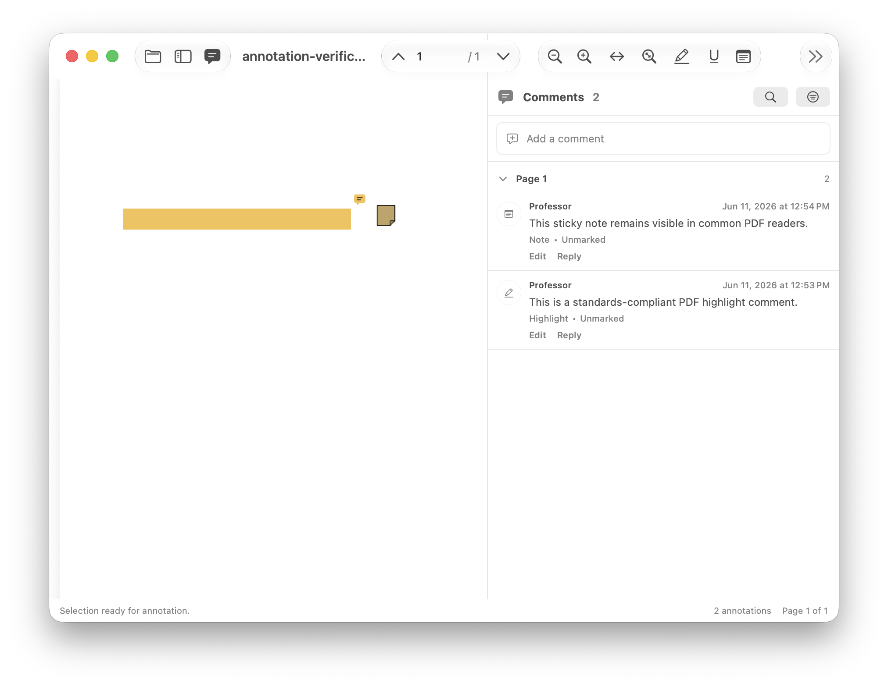

# I Hate PDFs

I Hate PDFs is a small native macOS PDF reader for local reading, highlighting, commenting, and review. It uses SwiftUI, AppKit, and PDFKit, keeps documents on your Mac, and avoids accounts, tracking, and cloud upload.

Minimum supported macOS version: macOS 13 Ventura.

Supported Mac architectures: Apple Silicon and Intel.

## Latest Release

Current version: `0.3.0` build `4`.

Download the v0.3 macOS DMG from the GitHub release page:

<https://github.com/akkolli/ihatepdfs/releases/tag/v0.3>

Use `IHatePDFs-v0.3-macos.dmg` for direct installation. Open the DMG, then move `I Hate PDFs.app` into `/Applications`.

The direct-download DMG is separate from the Mac App Store build. The App Store package uses bundle ID `net.akkolli.ihatepdfs` and is built with the sandbox entitlements documented in `docs/APP_STORE.md`.

## Features

- Open local `.pdf` files from disk.
- Drag a PDF onto the empty app window to open it.
- Read with smooth PDFKit scrolling, Retina rendering, zoom, fit-to-width, fit-to-page, and page navigation.
- Search selectable text PDFs from a compact toolbar control.
- Start in a focused single-pane reading layout, with thumbnail and comments sidebars hidden until requested.
- Remember thumbnail and comments sidebar visibility per PDF and coarse window size.
- Configure highlight and comment colors, including opacity, from Settings.
- Create standalone highlights from selected text.
- Create selected-text comments and underline comments.
- Create free-text annotations directly on the page.
- Press Return to save comments and replies, or Shift-Return for a new line.
- Click commented or underlined text in the PDF to reopen and edit the comment in place.
- Save annotations directly into the original PDF after an overwrite warning.
- Save As a new annotated copy.
- Share the annotated PDF through the native macOS share picker.
- Review annotations in a comments sidebar with page grouping, search, filters, replies, edit/delete, and click-to-navigate.

## Build From Source

Requirements:

- macOS 13 or newer
- Xcode 15 or newer with command line tools
- Swift Package Manager

Build and run the debug executable:

```sh
swift run IHatePDFs
```

Run tests:

```sh
swift test
```

Build a release `.app` bundle:

```sh
scripts/build-app.sh
```

Release app builds default to a universal `arm64` + `x86_64` executable. To build only the current architecture during development, run:

```sh
ARCHS="" scripts/build-app.sh
```

Create a downloadable `.dmg`:

```sh
scripts/make-dmg.sh
```

The packaged app is written to `dist/I Hate PDFs.app`; the disk image is written to `dist/IHatePDFs-v0.3-macos.dmg` by default.

Build an App Store upload package after installing the application signing certificate, installer signing certificate, and App Store provisioning profile:

```sh
APP_SIGNING_IDENTITY="3rd Party Mac Developer Application: Your Name (TEAMID)" \
INSTALLER_SIGNING_IDENTITY="3rd Party Mac Developer Installer: Your Name (TEAMID)" \
PROVISIONING_PROFILE="$HOME/Downloads/IHatePDFs_AppStore.provisionprofile" \
scripts/make-app-store-pkg.sh
```

The App Store package is written to `dist/IHatePDFs-v0.3-macos-appstore.pkg`. More details are in `docs/APP_STORE.md`.

## Installation

Download `IHatePDFs-v0.3-macos.dmg` from the latest GitHub release, open it, and move `I Hate PDFs.app` into `/Applications`.

For local direct-download builds, the app may not be Developer ID notarized. If macOS blocks first launch, open Finder, Control-click `I Hate PDFs.app`, choose Open, then confirm.

## Development

The project is a Swift Package with two targets:

- `IHatePDFsCore`: PDF annotation models, annotation export helpers, hit testing, color preference logic, file selection, and keyboard policies.
- `IHatePDFs`: SwiftUI macOS app, PDFKit bridge, toolbar, menus, sidebars, anchored comment popovers, opening, saving, sharing, and search.

Engineering rule: keep this a native macOS app with the smallest final bundle that still delivers the required fluidity and functionality. See `docs/ENGINEERING.md` before adding dependencies, bundled assets, PDF engines, runtimes, or broad architectural changes.

Useful checks:

```sh
swift test
swift build -c release
swift scripts/verify-sample-pdf.swift
swift scripts/verify-pdf-annotations.swift
```

The PDF verification scripts generate and inspect standard highlight, underline, selected-text comment, reply, free-text, contents, and annotation relationship dictionaries.

Manual release QA for Preview, Acrobat Reader, and browser PDF viewers is documented in `docs/QA.md`. App Store packaging is documented in `docs/APP_STORE.md`.

## Screenshots

Screenshots live in `docs/screenshots`.

Current repository screenshots:

- `docs/screenshots/no-document.png`
- `docs/screenshots/default-reading.png`
- `docs/screenshots/highlight-comment-popover.png`
- `docs/screenshots/main-window.png`
- `docs/screenshots/comments-sidebar.png`
- `docs/screenshots/dark-mode-reading.png`







## License

MIT. See `LICENSE`.
