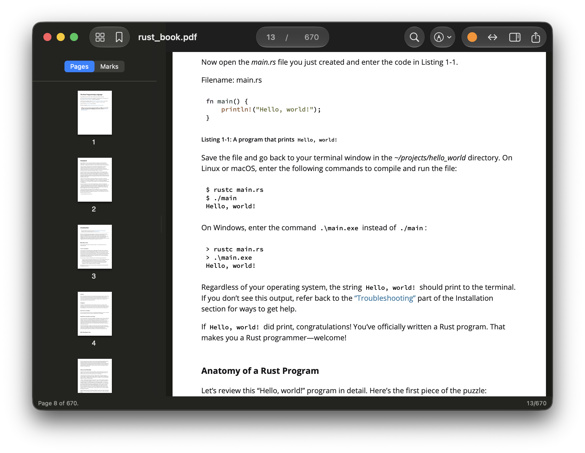
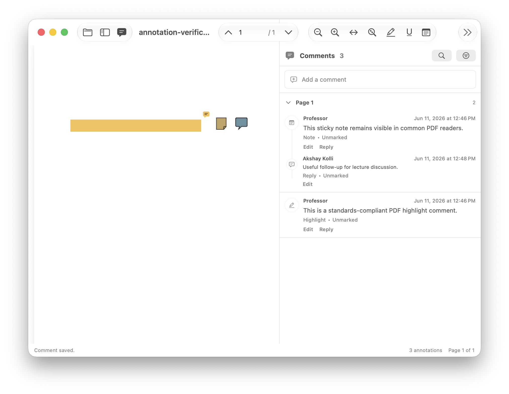
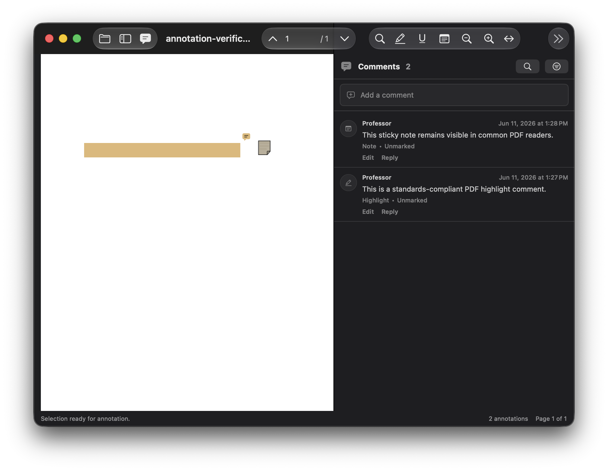

<p align="center">
  
</p>

<h1 align="center">I Hate PDFs</h1>

<p align="center">
  <strong>Native macOS PDF reading, highlighting, commenting, and review.</strong><br>
  Local-first. No accounts. No tracking. No cloud upload.
</p>

<p align="center">
  <a href="#build-from-source"></a>
  <a href="LICENSE"></a>
  <a href="https://github.com/akkolli/ihatepdfs/releases/latest"></a>
  <a href="#development"></a>
  <a href="CONTRIBUTING.md"></a>
</p>

<p align="center">
  <a href="https://github.com/akkolli/ihatepdfs/releases/latest">Download</a>
  ·
  <a href="https://github.com/akkolli/ihatepdfs/issues/new?template=bug_report.md">Report a bug</a>
  ·
  <a href="CONTRIBUTING.md">Contribute</a>
  ·
  <a href="https://www.akkolli.net/ihatepdfs/privacy">Privacy</a>
</p>

---

I Hate PDFs is a small native macOS PDF reader for local reading, highlighting, commenting, and review. It uses SwiftUI, AppKit, and PDFKit, keeps documents on your Mac, and avoids accounts, tracking, and cloud upload.

Minimum supported macOS version: macOS 13 Ventura.

Supported Mac architectures: Apple Silicon and Intel.

## Latest Release

Current version: `0.4.0` build `6`.

Download the v0.4 macOS DMG from the GitHub release page:

<https://github.com/akkolli/ihatepdfs/releases/tag/v0.4>

Use `IHatePDFs-v0.4-macos.dmg` for direct installation. Open the DMG, then move `I Hate PDFs.app` into `/Applications`.

The direct-download DMG is separate from the Mac App Store build. The App Store package uses bundle ID `net.akkolli.ihatepdfs` and is built with the sandbox entitlements documented in `docs/APP_STORE.md`.

## Features

- Open local `.pdf` files from disk.
- Drag a PDF onto the empty app window to open it.
- Read with smooth PDFKit scrolling, Retina rendering, zoom, fit-to-width, fit-to-page, and page navigation.
- Search selectable text PDFs from a compact toolbar control.
- Start each opened PDF in a focused single-pane reading layout, with the document fit to the available width and sidebars hidden until requested.
- Adapt the reader layout across compact, regular, and wide Mac windows while preserving usable PDF width.
- Configure highlight and comment colors, including opacity, from Settings.
- Reopen recent PDFs from the empty window or File > Open Recent.
- Close the current PDF back to the empty window without closing the app window.
- Create standalone highlights from selected text.
- Create selected-text comments and underline comments.
- Create free-text annotations directly on the page.
- Press Return to save comments and replies, or Shift-Return for a new line.
- Click commented or underlined text in the PDF to reopen and edit the comment in place.
- Save annotations directly into the original PDF after an overwrite warning.
- Save As a new annotated copy.
- Share the annotated PDF through the native macOS share picker.
- Review annotations in a comments sidebar with page grouping, search, filters, replies, edit/delete, and click-to-navigate.

## Privacy And Support

- Product and support page: <https://www.akkolli.net/ihatepdfs>
- Privacy policy: <https://www.akkolli.net/ihatepdfs/privacy>
- Support policy: [SUPPORT.md](SUPPORT.md)
- Security policy: [SECURITY.md](SECURITY.md)

I Hate PDFs works with user-selected local files. It does not require an account, collect analytics, or upload PDFs.

## Build From Source

Requirements:

- macOS 13 or newer
- Xcode 15 or newer with command line tools
- Swift Package Manager

Build and run the debug executable:

```sh
swift run IHatePDFs
```

Run tests:

```sh
swift test
```

Build a release `.app` bundle:

```sh
scripts/build-app.sh
```

Release app builds default to a universal `arm64` + `x86_64` executable. To build only the current architecture during development, run:

```sh
ARCHS="" scripts/build-app.sh
```

Create a downloadable `.dmg`:

```sh
scripts/make-dmg.sh
```

The packaged app is written to `dist/I Hate PDFs.app`; the disk image is written to `dist/IHatePDFs-v0.4-macos.dmg` by default.

Create the size-gated per-architecture archives:

```sh
scripts/make-tiny-archives.sh
```

This writes `dist/IHatePDFs-v0.4-macos-arm64.tar.xz` and `dist/IHatePDFs-v0.4-macos-x86_64.tar.xz`, then verifies each archive is under the 400,000-byte direct-download budget.

Build an App Store upload package after installing the application signing certificate, installer signing certificate, and App Store provisioning profile:

```sh
APP_SIGNING_IDENTITY="3rd Party Mac Developer Application: Your Name (TEAMID)" \
INSTALLER_SIGNING_IDENTITY="3rd Party Mac Developer Installer: Your Name (TEAMID)" \
PROVISIONING_PROFILE="$HOME/Downloads/IHatePDFs_AppStore.provisionprofile" \
scripts/make-app-store-pkg.sh
```

The App Store package is written to `dist/IHatePDFs-v0.4-macos-appstore.pkg`. More details are in `docs/APP_STORE.md`.

## Installation

Download `IHatePDFs-v0.4-macos.dmg` from the latest GitHub release, open it, and move `I Hate PDFs.app` into `/Applications`.

For local direct-download builds, the app may not be Developer ID notarized. If macOS blocks first launch, open Finder, Control-click `I Hate PDFs.app`, choose Open, then confirm.

## Development

The project is a Swift Package with two targets:

- `IHatePDFsCore`: PDF annotation models, annotation export helpers, hit testing, color preference logic, file selection, and keyboard policies.
- `IHatePDFs`: SwiftUI macOS app, PDFKit bridge, toolbar, menus, sidebars, anchored comment popovers, opening, saving, sharing, and search.

Engineering rule: keep this a native macOS app with the smallest final bundle that still delivers the required fluidity and functionality. See `docs/ENGINEERING.md` before adding dependencies, bundled assets, PDF engines, runtimes, or broad architectural changes.
Use `docs/WORKFLOW_AUDIT.md` when checking whether a feature matches the intended user workflow before changing or releasing it.
Use `docs/RELEASE.md` when preparing a new version; it is the checklist for version bumps, release validation, size gates, and upload packaging.

Open source contribution policy:

- Contributions are accepted under GPL-2.0-only. See [LICENSE](LICENSE).
- Start with [CONTRIBUTING.md](CONTRIBUTING.md) before opening a pull request.
- UI pull requests must include before/after screenshots or a short screen recording.
- Screenshots, recordings, and committed media files included with a pull request must each be under 1 MB.

Useful checks:

```sh
swift test
swift build -c release
swift scripts/verify-sample-pdf.swift
swift scripts/verify-pdf-annotations.swift
scripts/verify-release-artifacts.sh
```

The PDF verification scripts generate and inspect standard highlight, underline, selected-text comment, reply, free-text, contents, and annotation relationship dictionaries.
The release artifact verifier checks the current direct-download app and DMG by default. Run `REQUIRE_APP_STORE_PKG=1 scripts/verify-release-artifacts.sh` after creating an App Store package.

Manual release QA for Preview, Acrobat Reader, and browser PDF viewers is documented in `docs/QA.md`. App Store packaging is documented in `docs/APP_STORE.md`, and paste-ready App Store metadata is in `docs/APP_STORE_COPY.md`.

## Screenshots

Screenshots live in `docs/screenshots`.

Current repository screenshots that are useful for local review:

- `docs/screenshots/default-reading.png`
- `docs/screenshots/main-window.png`
- `docs/screenshots/comments-sidebar.png`
- `docs/screenshots/dark-mode-reading.png`
- `docs/screenshots/preview-interoperability.png`

`docs/screenshots/no-document.png` and `docs/screenshots/highlight-comment-popover.png` are capture targets that need to be retaken before public release docs use them.







## License

GNU General Public License version 2 only. See [LICENSE](LICENSE).
